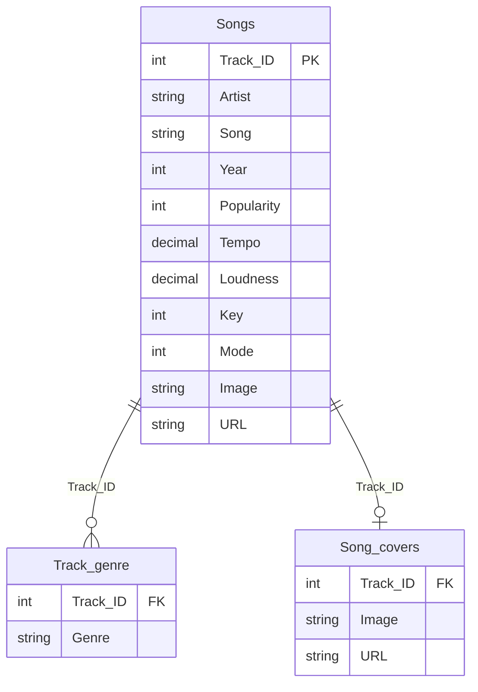

<div align="center">

# Spotify Music Analytics Dashboard

An interactive Power BI dashboard for exploring track popularity, artists, audio characteristics, musical keys, genres, and listening trends across release years.


</div>

## Overview

This project transforms a Spotify tracks dataset into a polished, interactive analytics experience. The report combines data cleaning in Power Query, semantic modelling, DAX measures, dynamic filtering, album-cover enrichment, and a Spotify-inspired visual design.

Users can filter the report by year and musical key to investigate how popularity, tempo, loudness, acousticness, genre distribution, and major/minor modality change across the catalogue.

> This is an educational and portfolio project. It is not affiliated with, sponsored by, or endorsed by Spotify.

## Dashboard Preview

<!--
Add a clean, full-screen dashboard screenshot to:
docs/images/spotify-dashboard-overview.png

Then uncomment the following line:

-->

## Dashboard Snapshot

The unfiltered dashboard currently summarizes:

| KPI | Value |
|---|---:|
| Total songs | 2,000 |
| Total artists | 835 |
| Average tempo | 120.12 BPM |
| Average loudness | -5.51 dB |
| Major-mode share | 55% |

These values update automatically when report slicers or visual selections are applied.

## Business Questions Answered

- Which tracks are the most popular overall and within each year?
- Which artists and genres occur most frequently in the dataset?
- How does average popularity vary by acousticness and loudness level?
- Which musical keys appear most often?
- What percentage of tracks use major versus minor modality?
- How do tempo, loudness, and other audio characteristics change with filters?
- Which songs should be highlighted for a selected year or key?

## Core Features

- Interactive **Year** and **Chord/Key** slicers.
- Dynamic KPI cards for songs, artists, loudness, tempo, and duration.
- Top-song table with album artwork and track names.
- Top genres ranked by distinct track count.
- Song distribution by musical key.
- Major-versus-minor percentage gauge.
- Popularity analysis by acousticness and loudness bands.
- Cross-filtering between visuals for fast exploration.
- Spotify-inspired dark theme using `#1FD662` as the primary accent.
- Source-control-friendly Power BI Project (`.pbip`) structure.

## Technology Stack

| Technology | Purpose |
|---|---|
| Power BI Desktop | Report design, modelling, and visualization |
| Power Query (M) | Data cleaning, transformation, splitting, and merging |
| DAX | KPIs, averages, percentages, and distinct counts |
| Power BI Service | Online viewing, interaction, and full-screen presentation |
| PBIP / TMDL | Text-based report and semantic-model definitions |
| Git and GitHub | Version control and project collaboration |

## Data Preparation

The source data was prepared in Power Query before loading it into the semantic model.

Key transformations include:

1. Created a stable `Track_ID` index because the source did not include a Spotify track identifier.
2. Converted `duration_ms` to the more readable `Duration(Min)` field.
3. Applied numeric data types to tempo, loudness, popularity, and audio-feature columns.
4. Converted key numbers from `0–11` into musical key names such as `C`, `C#/Db`, and `D`.
5. Interpreted `Mode = 0` as minor and `Mode = 1` as major.
6. Split multi-genre values into rows for genre-level analysis.
7. Trimmed and standardized inconsistent genre labels, including the normalization of `hip` and `hop` into `Hip-Hop`.
8. Removed duplicate track-genre combinations.
9. Created acousticness, loudness, and tempo level groupings for audience-friendly comparisons.
10. Merged track and cover-image URLs into the song data using `Track_ID`.

## Data Model



`Songs` is the primary analytical table. `Track_genre` supports one-to-many genre analysis after splitting multi-value genre strings, while `Song_covers` provides web and album-art enrichment.

## Field Interpretation

| Field | Interpretation |
|---|---|
| `Popularity` | Spotify-style relative popularity score from 0 to 100; it is not a listener or stream count |
| `Tempo` | Estimated tempo in beats per minute (BPM) |
| `Loudness` | Overall loudness measured in decibels (dB) |
| `Acousticness` | Confidence from 0 to 1 that the track is acoustic |
| `Danceability` | Suitability for dancing, represented on a 0-to-1 scale |
| `Energy` | Perceived intensity and activity, represented on a 0-to-1 scale |
| `Valence` | Musical positivity, represented on a 0-to-1 scale |
| `Mode` | `0 = Minor`, `1 = Major` |
| `Key` | Pitch-class number from 0 to 11 |
| `Duration(Min)` | Track duration expressed in minutes |
| `Explicit` | Indicates whether a track is marked as containing explicit content |

### Musical Key Mapping

| Value | Key | Value | Key |
|---:|---|---:|---|
| 0 | C | 6 | F#/Gb |
| 1 | C#/Db | 7 | G |
| 2 | D | 8 | G#/Ab |
| 3 | D#/Eb | 9 | A |
| 4 | E | 10 | A#/Bb |
| 5 | F | 11 | B |

## Representative DAX Measures

```DAX
Total Songs =
DISTINCTCOUNT('Songs'[Track_ID])
```

```DAX
Total Artists =
DISTINCTCOUNT('Songs'[Artist])
```

```DAX
Average Popularity =
AVERAGE('Songs'[Popularity])
```

```DAX
Average Tempo =
AVERAGE('Songs'[Tempo])
```

```DAX
Average Loudness =
AVERAGE('Songs'[Loudness])
```

```DAX
Average Song Duration =
AVERAGE('Songs'[Duration(Min)])
```

Because `Mode` is binary, its average represents the proportion of major-mode tracks:

```DAX
Major Mode Percentage =
AVERAGE('Songs'[Mode])
```

```DAX
Track Count =
DISTINCTCOUNT('Track_genre'[Track_ID])
```

## Repository Structure

```text
spotify-power-bi-dashboard/
├── Spotify Dashboard.Report/
│   ├── definition/
│   ├── StaticResources/
│   └── definition.pbir
├── Spotify Dashboard.SemanticModel/
│   ├── definition/
│   │   ├── cultures/
│   │   └── tables/
│   └── definition.pbism
├── Spotify Dashboard.pbip
├── .gitignore
└── README.md
```

The generated local Power BI cache and settings files are excluded from source control:

```gitignore
**/.pbi/localSettings.json
**/.pbi/cache.abf
```

## Run the Project Locally

### Prerequisites

- Power BI Desktop with Power BI Project (`.pbip`) support.
- Git.
- Access to the project dataset if the report's local source path must be updated.

### Installation

1. Clone the repository:

   ```bash
   git clone https://github.com/ChamathkaGawarammana/spotify-power-bi-dashboard.git
   ```

2. Move into the project directory:

   ```bash
   cd spotify-power-bi-dashboard
   ```

3. Open `Spotify Dashboard.pbip` in Power BI Desktop.

4. If Power BI reports a missing source file, open **Transform data → Data source settings** and update the path to your local dataset.

5. Select **Refresh**, verify the visuals, and save the project.

## Publish to Power BI Service

1. Open the project in Power BI Desktop.
2. Select **Home → Publish**.
3. Choose an authorized Power BI workspace.
4. Open the report in Power BI Service.
5. Use **View → Full screen** for a clean presentation or portfolio recording.

## Important Data Notes

- `Track_ID` is a project-generated row identifier, not an official Spotify track ID.
- Popularity is a relative score and must not be presented as the number of listeners or streams.
- Album images and track links depend on externally hosted URLs remaining available.
- Group labels such as acousticness level and loudness level are analytical categories created for this dashboard.
- Results describe the supplied dataset and should not be interpreted as the complete Spotify catalogue.

## Future Improvements

- Add a dedicated date dimension for richer time intelligence.
- Add drill-through pages for artists and individual tracks.
- Add tooltips that explain each Spotify audio feature.
- Introduce dynamic ranking and Top N parameters.
- Add correlation and distribution analysis for audio characteristics.
- Automate cover-art and track-link enrichment through an approved API workflow.
- Add a mobile-optimized Power BI layout.

## Author

**Chamathka Gawarammana**  
[GitHub Profile](https://github.com/ChamathkaGawarammana)

## Disclaimer

Spotify and the Spotify logo are trademarks of Spotify AB. This independent project was created for learning, data-analysis demonstration, and portfolio purposes. No ownership of Spotify branding, metadata, or artwork is claimed.

